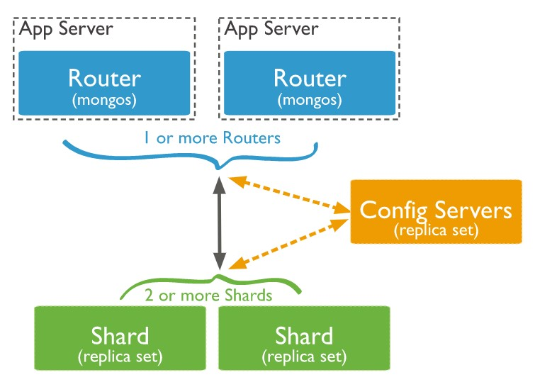
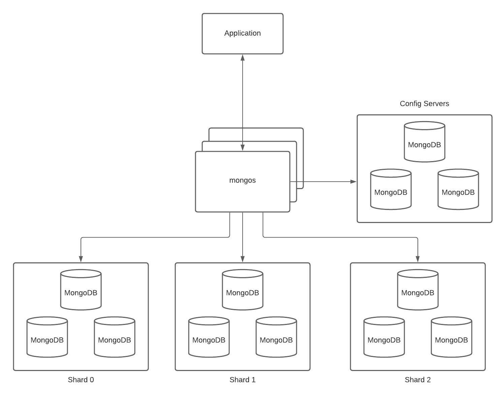

# mongodb-sharding-demo
This project demonstrates how to get MongoDB Sharded Cluster up and running in some simple steps. We also provide a working REST API that interacts with the cluster.
## Sharding
### What is Sharding
[Sharding](https://docs.mongodb.com/manual/reference/glossary/#term-sharding) is a method for distributing data across multiple machines. MongoDB uses sharding to support deployments with very large data sets and high throughput operations.

Database systems with large data sets or high throughput applications can challenge the capacity of a single server. For example, high query rates can exhaust the CPU capacity of the server. Working set sizes larger than the system’s RAM stress the I/O capacity of disk drives.

There are two methods for addressing system growth: vertical and horizontal scaling. MongoDB supports horizontal scaling through [Sharding](https://docs.mongodb.com/manual/reference/glossary/#term-sharding).
### Sharded Cluster
A MongoDB sharded cluster consists of the following components:
- [shard](https://docs.mongodb.com/manual/core/sharded-cluster-shards/): Each shard contains a subset of the sharded data. Each shard can be deployed as a replica set.
- [mongos](https://docs.mongodb.com/manual/core/sharded-cluster-query-router/): The mongos acts as a query router, providing an interface between client applications and the sharded cluster.
- [config servers](https://docs.mongodb.com/manual/core/sharded-cluster-config-servers/): Config servers store metadata and configuration settings for the cluster.

The following graphic describes the interaction of components within a sharded cluster:



MongoDB shards data at the [collection](https://docs.mongodb.com/manual/reference/glossary/#term-collection) level, distributing the collection data across the shards in the cluster.
## What will we setup
We will setup a simple MongoDB sharded cluster as following:


The application is a simple REST API microservice manage restaurants, and we will demonstrate how to to distribute restaurant data accross 3 shards by city.

In the case you want [high availability](https://docs.mongodb.com/manual/reference/glossary/#term-high-availability), you could deploy a shard as a [replica set](https://docs.mongodb.com/manual/replication/#replication-in-mongodb), and the deployment could be like (for the simplicity of this demonstration, we skip this for now):



## How to use
### Setup
The setup development workspace process is simpler than ever with following steps:
1. Install [JDK 11](https://www.oracle.com/java/technologies/javase-jdk11-downloads.html).
1. Install [Docker for Desktop](https://www.docker.com/products/docker-desktop).
1. Install [Maven](https://maven.apache.org/download.cgi?Preferred=ftp://mirror.reverse.net/pub/apache/).
1. Clone this project to your local machine.
1. Open terminal and make sure you're at the root directory of this project, run the command `docker-compose up` (this will automatically get MongoDB Sharded Cluster up and running for you).
That's all.
### Run the application
You can run Spring Boot application in different ways, but first make sure you are in the root directory of the application you want to run (by `cd restaurant-service`):
- Run jar file (of course you need to build it first): ```mvn install && java -jar target/restaurant-service-0.0.1-SNAPSHOT.jar```
- Run with Spring Boot: ```mvn spring-boot:run```

This application is a simple standard REST API service which manage restaurants with the default URL is http://localhost:8080/restaurants. It exposes some all standard CRUD operations already. 

To generate sample data, you could run the command:
```
curl --location --request POST 'http://localhost:8080/restaurants/generate' \
--header 'Content-Type: application/json' \
--data-raw '{
    "numberOfRestaurant": 100000
}'
```
with the **numberOfRestaurant** is the sample restaurants you want to generate (to see sharding in action, you could generate 1 milion restaurants).
### Configure MongoDB Sharded Cluster
1. Connect to your MongoDB cluster by command:
```
mongo --host 127.0.0.1 --port 27017 --authenticationDatabase admin --username root --password 123456
```
2. Enable sharding for **sample** database:
```
sh.enableSharding("sample")
```
3. Shard the **restaurant** collection (for this example, we shard the **restaurant** collection by **city**. Please refer [here](https://docs.mongodb.com/manual/core/sharding-shard-key/#choosing-a-shard-key) for choosing a good shard key):
```
sh.shardCollection("sample.restaurant", {"city": 1})
```
4. Get the sharding status of the cluster (refer [here](https://docs.mongodb.com/manual/reference/method/sh.status/) for more detail on this command):
```
sh.status()
```
## Where to go next
For more information on MongoDB sharding topic, please refer [MongoDB Documentation](https://docs.mongodb.com/manual/sharding/)
